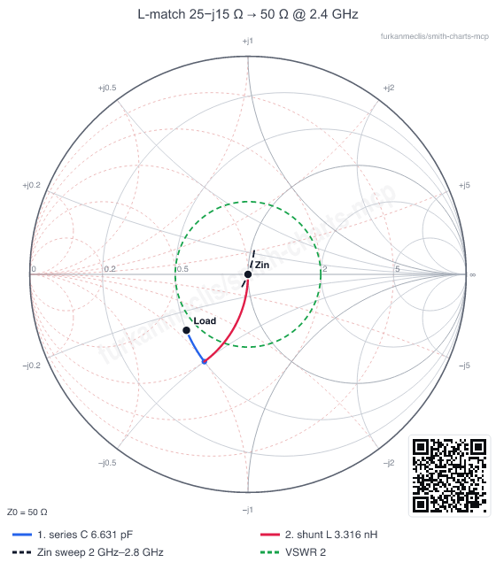
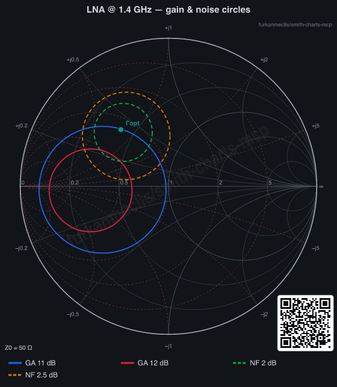
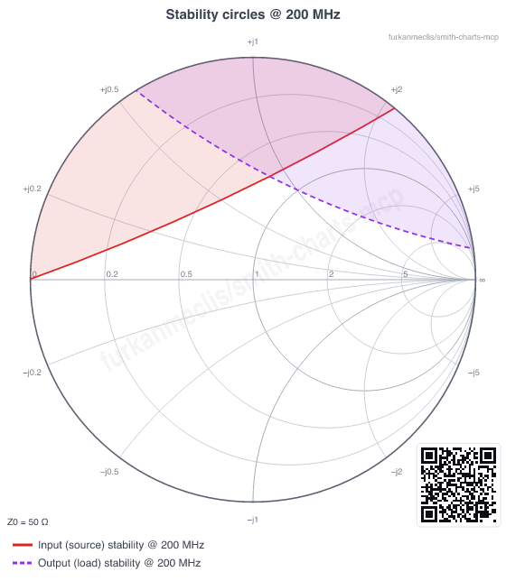

# smith-charts-mcp

<p align="center">
  <a href="https://github.com/furkanmeclis/smith-charts-mcp/actions/workflows/ci.yml"></a>
  <a href="https://github.com/furkanmeclis/smith-charts-mcp/releases"></a>
  <a href="https://github.com/furkanmeclis/smith-charts-mcp/pkgs/container/smith-charts-mcp"></a>
  
  
  <a href="LICENSE"></a>
</p>

**RF ve mikrodalga mühendisliği için Smith diyagramı merkezli, hafif bir [Model Context Protocol](https://modelcontextprotocol.io) sunucusu.**

Claude, Cursor ya da herhangi bir MCP istemcisine şu yetenekleri kazandırır:
- empedans dönüşümleri,
- iletim hattı ve merdiven devre analizi,
- L / Pi / T / stub / λ/4 eşleştirme devresi sentezi,
- transistör S-parametre analizi (kararlılık, kazanç, gürültü, eşlenik eşleştirme),
- yayın kalitesinde Smith diyagramı çizimi.

Özetler **Türkçe veya İngilizce** verilir.

[English README](README.md)

<p align="center">
  
  
  
</p>

- **14 araç · 7 prompt · 8 resource**
- **Her yerde çalışır**: yerelde stdio ile ya da `/mcp` adresinde uzak bir **Streamable HTTP** sunucusu olarak. Böylece Claude'a **web, masaüstü ve mobilde** özel connector olarak eklenebilir.
- **Hafif**: yalnızca 2 çalışma zamanı bağımlılığı (`@modelcontextprotocol/sdk`, `zod`). PNG için isteğe bağlı `@resvg/resvg-js`. Tarayıcı, web çatısı ya da veritabanı yok.
- **Mühendis dostu girdi**: `"2.4GHz"`, `"10nH"`, `"1.5pF"`, `"4k7"`, `"25-j15"`, `"0.25λ"`, `"45deg"`, `"12mm"`.
- **Zincirlenebilir**: tüm eşleştirme araçları `components` alanını, `analyze_circuit` ve `render_smith_chart` araçlarının kabul ettiği formatta döndürür. Tasarla, doğrula, çiz: üç çağrı yeterli.
- **Doğrulanmış matematik**: Pozar ders kitabı örnekleri dahil 66 test. Sentezlenen her devre, sonuç döndürülmeden önce yeniden simüle edilir.

---

## Kurulum

### Barındırılan sunucu (kurulum gerektirmez, mobilde çalışır)

**`https://smith-chart-mcp.technowide.software/mcp`** adresini özel connector olarak ekleyin:
- Claude (web, masaüstü, iOS, Android): **Ayarlar → Connectors → Add custom connector**.
- Uzak Streamable HTTP MCP sunucularını destekleyen diğer istemciler.

Barındırılan sunucu her zaman son sürümü çalıştırır. Nelerin değiştiğini görmek için `version_info` aracını sorabilirsiniz.

### Yerel (stdio)

Node.js ≥ 20 gerekir.

### Claude Code

```bash
claude mcp add smith-charts -e SMITH_CHARTS_MCP_LANG=tr -- npx -y smith-charts-mcp
```

### Claude Desktop / Cursor / Windsurf / VS Code

MCP yapılandırmanıza (`claude_desktop_config.json`, `.cursor/mcp.json`, …) ekleyin:

```json
{
  "mcpServers": {
    "smith-charts": {
      "command": "npx",
      "args": ["-y", "smith-charts-mcp"],
      "env": { "SMITH_CHARTS_MCP_LANG": "tr" }
    }
  }
}
```

### Kaynak koddan

```bash
git clone https://github.com/furkanmeclis/smith-charts-mcp.git
cd smith-charts-mcp
npm install
npm run build
```

Ardından istemcinizi `node /mutlak/yol/smith-charts-mcp/dist/index.js` komutuna yönlendirin.

`npm run inspect` ile MCP Inspector'da etkileşimli olarak deneyebilirsiniz.

### Uzak sunucu (Claude mobil, web ve diğer cihazlar)

Streamable HTTP transport'unu başlatın ve HTTPS arkasına koyun:

```bash
npm run build
PORT=3000 node dist/index.js --http          # → http://0.0.0.0:3000/mcp
# ya da Docker ile
docker build -t smith-charts-mcp .
docker run -d -p 3000:3000 --restart unless-stopped smith-charts-mcp
```

Ters proxy (reverse proxy) ile dışarı açın, örneğin `https://smith-chart-mcp.example.com/mcp`. Ardından Claude'da **Ayarlar → Connectors → Add custom connector** adımından bu URL'yi ekleyin. Connector mobil uygulamalarda da çalışır.

HTTP modunun sağladıkları:
- **Durumsuz (stateless)**: her istek kendi başına işlenir, istediğiniz kadar kopya çalıştırabilirsiniz.
- **Uç noktalar**:
  - `GET /health`: sağlık kontrolü.
  - `GET /`: bilgi sayfası.
  - `POST /mcp`: MCP uç noktası.
  - CORS açık.
- **Koruma**: IP başına hız limiti (`RATE_LIMIT_PER_MINUTE`, varsayılan 120) ve 4 MB gövde sınırı.
- **Dosya sistemi erişimi yok**: `touchstone_path` ve `output_path` kapalıdır, böylece istemciler sunucunuzdaki dosyaları okuyamaz veya yazamaz. Touchstone verisini `touchstone_content` ile gönderin. `SMITH_CHARTS_MCP_ALLOW_FS=1` ayarını yalnızca özel bir kurulumda açın.
- **Docker imajı**: DejaVu fontlarını içerir, böylece PNG etiketleri Linux'ta doğru çizilir.

---

## Araçlar

| Araç | Ne yapar |
|---|---|
| `impedance_convert` | Z, z, Y, Γ, VSWR veya geri dönüş kaybından birini verirsiniz, diğerlerinin hepsini hesaplar: VSWR, geri dönüş ve uyumsuzluk kaybı, Q, ayrıca verilen frekansta eşdeğer seri/paralel L veya C. |
| `tline_input_impedance` | Kayıplı veya kayıpsız hattın giriş empedansı. Uzunluk elektriksel ya da fiziksel olabilir (εeff / hız faktörü). Yükte ve girişte Γ, gerilim maksimum ve minimum konumları. |
| `analyze_circuit` | Yük → bileşenler → kaynak kademesi. Her düğümde Z, Γ ve VSWR; frekans taraması, bant genişliği ve tolerans köşe analizi. |
| `design_l_match` | Tüm L-devresi çözümleri, kompleks kaynak ve yük dahil. Alçak/yüksek geçiren sınıflandırması, DC davranışı, bant genişliği ve E-serisi yuvarlama. |
| `design_pi_t_match` | Hedef yüklü Q için Pi ve T devreleri; alçak geçiren, yüksek geçiren ve karma tüm varyantlar. |
| `design_stub_match` | Tek stub eşleştirme (açık veya kısa devre uçlu, paralel veya seri). Uzunluklar λ, derece ve metre cinsinden. |
| `design_quarter_wave` | λ/4 trafo. Kompleks yükler önce en yakın gerilim maksimumuna veya minimumuna döndürülür. |
| `parse_touchstone` | `.s1p` / `.s2p` (MA/DB/RI) özeti: frekans tablosu, en iyi eşleşme, K/μ, MAG/MSG, kararlı aralıklar ve gürültü verisi. |
| `amplifier_stability` | Rollett K, \|Δ\|, μ ve μ'; kaynak ve yük kararlılık çemberleri ile kararlı bölgeleri. Dosyanın tamamını tarayabilir. |
| `gain_circles` | Mevcut (available), çalışma (operating) ve tek yönlü (unilateral) kazanç çemberleri. Referans olarak MAG/MSG ya da G_S,max / G_L,max. |
| `noise_circles` | Sabit gürültü figürü çemberleri; önerilen bir kaynak empedansı için NF ve mevcut kazanç hesabı. |
| `conjugate_match` | Eşzamanlı eşlenik eşleştirme: ΓS, ΓL, GT,max, MSG ve U; ayrıca hazır giriş ve çıkış L-devreleri. |
| `version_info` | Çalışan sürüm, istenen sürümün sürüm notları ve "X'ten bu yana neler değişti" bilgisi. Çalışma zamanı yeteneklerini de bildirir. |
| `render_smith_chart` | PNG/SVG Smith diyagramı; Z, Y veya Z+Y ızgarası, açık veya koyu tema. Çizebildikleri: devre yayları, tarama eğrisi, noktalar, VSWR/Q çemberleri, istenen herhangi bir çember, Touchstone S11 izi, taralı kararlılık çemberleri, kazanç ve gürültü çemberleri. Görüntüyü dosyaya da kaydedebilir. |

Tüm araçlar `language: "en" | "tr"` parametresi alır. Sonuç, okunabilir bir özet ile tam sayısal JSON'dan oluşur; JSON aynı zamanda `structuredContent` olarak da verilir.

### Devre formatı

Bileşenler **yükten kaynağa doğru** sıralanır. `placement`: `"series"` sinyal yoluna seri, `"shunt"` toprağa paralel anlamına gelir.

```json
{
  "load": { "z": "25-j15" },
  "frequency": "2.4GHz",
  "components": [
    { "type": "capacitor", "placement": "series", "value": "6.63pF" },
    { "type": "inductor",  "placement": "shunt",  "value": "3.32nH", "q": 40 }
  ],
  "sweep": { "span": "800MHz" },
  "bandwidth_vswr": 2
}
```

Eleman tipleri:
- `inductor`, `capacitor`, `resistor`: Q, ESR, ESL ve tolerans destekler.
- `rlc`: seri veya paralel bağlantı.
- `impedance`: sabit Z ya da Z(f) tablosu.
- `transmission_line`: kayıplı, εeff veya hız faktörü ile.
- `stub`: açık veya kısa devre uçlu, paralel veya seri.
- `transformer` ve `coupled_inductors`.

Yük şunlardan biri olabilir: sabit `z`, `gamma`, `table` ya da ölçülmüş bir **.s1p** dosyası (`touchstone_path`), örneğin bir antenin VNA ölçümü.

## Prompt'lar

| Prompt | İş akışı |
|---|---|
| `match_impedance` | Yükü analiz et, tüm yöntemlerle eşleştirme tasarla ve karşılaştır, en iyisini doğrula ve çiz. |
| `design_amplifier` | `.s2p` dosyasından başlayarak: kararlılık, ardından maksimum kazanç / düşük gürültü / hedef kazanç dengesi, sonra giriş ve çıkış devreleri. |
| `check_stability` | Frekansa göre kararlılık raporu ve taralı kararlılık çemberleri. |
| `tune_antenna` | Ölçülmüş `.s1p` anteni hedef frekansa ayarla ve elde edilen bant genişliğini raporla. |
| `explain_smith_chart` | Seviyeli (başlangıç, orta, ileri), etkileşimli Smith diyagramı dersi ve alıştırma soruları. |
| `solve_rf_problem` | Ödev/sınav sorusunun adım adım çözümü; her sayı araçlarla çapraz kontrol edilir. |
| `transmission_line_problem` | Sonlandırılmış bir hat için Zin, duran dalga ve gerilim maksimum/minimum noktaları. |

Tüm prompt'lar `language` argümanı alır (`en` / `tr`).

## Resource'lar

- `smith://docs/formulas.tr.md`, `smith://docs/formulas.en.md`: yansıma, iletim hattı, eşleştirme, kararlılık, kazanç ve gürültü formül kartı.
- `smith://docs/components.tr.md`, `smith://docs/components.en.md`: devre giriş formatı.
- `smith://changelog.tr.md`, `smith://changelog.en.md`: sürüm geçmişi.
- `smith://examples/bjt-100m-2g.s2p`, `smith://examples/lna-1g4-noise.s2p`: deneme için örnek cihazlar.

## Örnek kullanım

> **Siz:** 2.4 GHz'de 25 − j15 Ω yükü 50 Ω'a eşle. DC bloklama ve standart E24 parçalar istiyorum, Smith diyagramını da göster.
>
> **Claude** sırasıyla `design_l_match` (preference `dc_block`, `snap_to_series: "E24"`), `analyze_circuit` (taramalı) ve `render_smith_chart` araçlarını çağırır. Yanıtı şöyle olur: *seri C 6.63 pF → paralel L 3.32 nH. E24 karşılıkları olan 6.8 pF ve 3.3 nH ile 2.4 GHz'de VSWR 1.01. VSWR ≤ 2 bandı yaklaşık 1.5 GHz'den 4.6 GHz'in ötesine kadar uzanır.* Yukarıdaki diyagram da yanıta eklenir.

## Yapılandırma

| Değişken | Varsayılan | Anlamı |
|---|---|---|
| `SMITH_CHARTS_MCP_LANG` | `en` | Çağrıda `language` verilmediğinde kullanılacak özet dili (`en` veya `tr`). |
| `MCP_TRANSPORT` | `stdio` | `http` verilirse Streamable HTTP sunucusu başlar (`--http` ile aynı). |
| `PORT` / `HOST` / `MCP_PATH` | `3000` / `0.0.0.0` / `/mcp` | HTTP dinleme ayarları. |
| `RATE_LIMIT_PER_MINUTE` | `120` | İstemci IP'si başına dakikadaki HTTP istek sayısı (`0` limiti kapatır). |
| `SMITH_CHARTS_MCP_ALLOW_FS` | kapalı | HTTP üzerinden `touchstone_path` / `output_path` kullanımına izin verir. Yalnızca güvenilir, özel kurulumlarda açın. |
| `SMITH_CHARTS_MCP_FONT`, `SMITH_CHARTS_MCP_FONT_DIRS` | otomatik | PNG yazıları için font ailesi ve ek font dizinleri. |

PNG çıktısı isteğe bağlı `@resvg/resvg-js` bağımlılığını kullanır. Bu paket yoksa `render_smith_chart` SVG döndürür.

Her grafikte iki işaret bulunur:
- soluk bir `furkanmeclis/smith-charts-mcp` filigranı;
- sağ alttaki boş köşede bu repoya bağlantı veren bir QR kod.

QR derleme zamanında üretilir, yani çalışma zamanına bağımlılık eklemez. Bir fork için yeniden üretmek isterseniz `npm run gen:qr -- <url>` çalıştırın.

## Geliştirme

```bash
npm install
npm test          # node --test, TypeScript kaynaklarını doğrudan çalıştırır (Node ≥ 22.18)
npm run typecheck
npm run build     # → dist/
npm run dev       # sunucuyu kaynak koddan çalıştırır (stdio)
npm run dev:http  # … ya da HTTP üzerinden :3000/mcp
```

Proje yapısı:
- `src/core`: saf matematik, MCP bağımlılığı yok.
- `src/render`: SVG ve PNG çizimi.
- `src/tools`: MCP araç tanımları.
- `src/prompts` ve `src/resources`.

## Sürümleme ve yayınlar

Proje [Anlamsal Sürümleme](https://semver.org/lang/tr/) kullanır. Sürüm notları [CHANGELOG.md](CHANGELOG.md) dosyasında ve sunucunun kendisinde bulunur: *"hangi sürümdesin, neler değişti?"* diye sorduğunuzda model `version_info` aracını çağırır.

Bir `vX.Y.Z` tag'i push edildiğinde release iş akışı:
- sürümü doğrular ve testleri çalıştırır;
- GitHub release'ini yayınlar;
- çok mimarili `ghcr.io/furkanmeclis/smith-charts-mcp` imajını yayınlar;
- barındırılan sunucuyu yeniden deploy eder.

Release adımlarının tamamı için [CONTRIBUTING.md](CONTRIBUTING.md) dosyasına bakın.

## Katkı

Issue ve PR'lar Türkçe ya da İngilizce olabilir. Önce [CONTRIBUTING.md](CONTRIBUTING.md) ve [Davranış Kuralları](CODE_OF_CONDUCT.md) dosyalarını okuyun. Güvenlik sorunlarını [SECURITY.md](SECURITY.md) dosyasında anlatıldığı gibi gizli olarak bildirin.

## Lisans

MIT © Furkan Meclis
